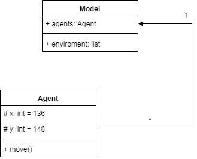
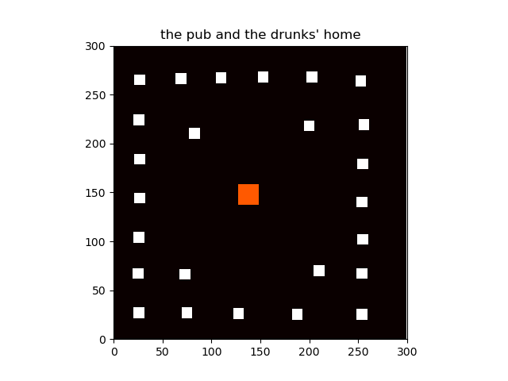
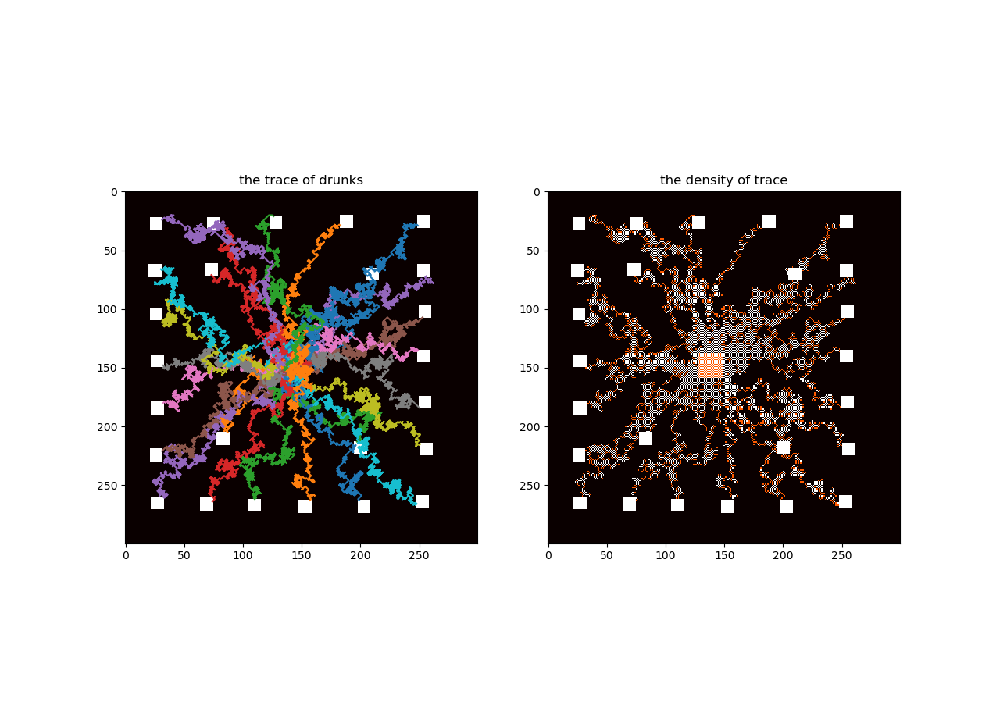
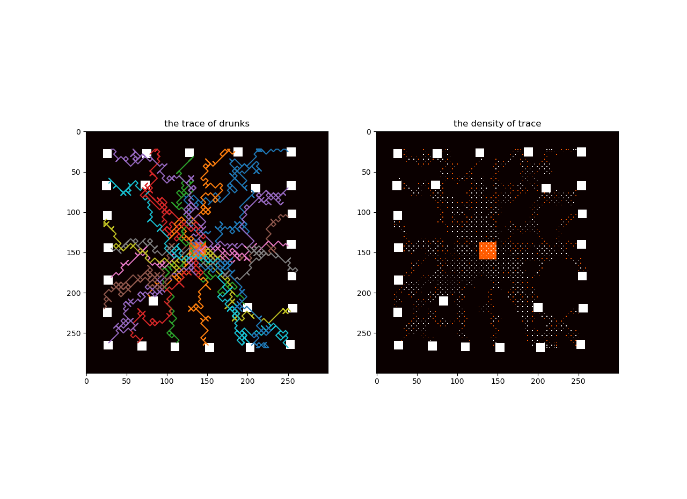

# Python Computer Exercise Assessment 2

## Planning for drunks

### Software description

Imagine you are in control of town planning, and your town is full of drunks. You need to build a model that shows where drunks walk when they're trying to get home.


> Build a program to do the following...

1. Pull in the data file and finds out the pub point and the home points.
2. Draws the pub and homes on the screen.
3. Models the drunks leaving their pub and reaching their homes, and stores how many drunks pass through each point on the map.
4. Draws the density of drunks passing through each point on a map.
5. Saves the density map to a file as text.

### Installation Environment

Install Spyder (Python 3.7) from Anaconda Navigator 3 in the computer.

### Software developing process

#### UML diagram



#### modeling idea

##### 1. start point

By drawing the images of pub and  drunks' home, we assume that all drunks start from the same point to find their own home, and the choice of this point has little effect for the model, so we choose the middle position of the pub area

Here i choose x=136, y=148 as my start point (the Pub), all drunks start at this point. 

The start point is in orange colour.



##### 2. move drunks

move the drunk randomly left/right/up/down in a loop that picks randomly the way it will go like this code

```python
	def move(self):
		Step = 1
		if random.random() < 0.5:
			self.y = self.y + Step
		else:
			self.y = self.y - Step
		
		if random.random() < 0.5:
			self.x = self.x + Step
		else:
			self.x = self.x - Step

		if self.x < 20:
			self.x = self.x + Step
		if self.x > 270:
			self.x = self.x - Step

		if self.y < 20:
			self.y = self.y + Step
		if self.y > 270:
			self.y = self.y - Step
```

If you set the `step` to a small value, such as `1`, it will take a long time to find the trajectory, and a large number of trajectory points will be generated.

Due to that, i select 3 as my step number, so the step = 3, it is much easier to find the trajectory.



Since need to adjust the value of `step` to get better trajectory.

##### 3. drunks' step number

Because drunks move randomly, it is found during the experiment that the number of steps to return home is not large. 

Therefore, a rule was designed during the software design process to dynamically increase the number of steps, thereby reducing the number of steps in the process.

```python
step_num = step_num + num_iter/100
```

Dynamically increase the number of steps as the number of iterations increases.


### A result



The Image in left illustrates the trace of drunks whereas the image in right demonstrates the density of trace.


### License

This project is under the MIT License, please see the 'LICENSE.txt' to check details.


